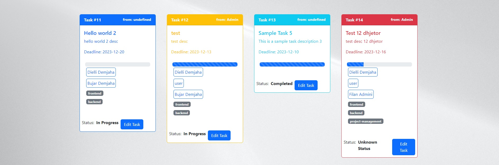

# Task Form

Welcome to Task Form, a powerful task management application built with PHP Laravel and React JS. Utilized in the app is also Laravel Spatie for user roles and Laravel Sanctum for token based users authentication.

## Table of Contents
- [Introduction](#introduction)
- [Features](#features)
- [Technologies Used](#technologies-used)
- [Installation](#installation)
- [Usage](#usage)
- [Contributing](#contributing)
- [License](#license)

## Introduction
Task Form is a full-stack application designed to streamline task management, offering a feature-rich environment for users to efficiently handle their workload. The application focuses on user authentication, role-based access control, dynamic time management, and task categorization.

## Features
- **User Authentication with Sanctum:** Securely manage user access using Laravel Sanctum.
- **User Roles with Spatie:** Implement role-based access control, restricting certain operations to admin users.
- **CRUD Operations for Tasks:** Create, Read, Update, and Delete tasks with ease.
- **Dynamic Time-Management Functionality:** Calculate task progress based on start and end dates, visualized with a progress-bar UI.
- **Task Categorization:** Categorize tasks for better organization.
- **4th Full-Stack Application:** Built with PHP Laravel, React JS, and MySQL, showcasing extensive full-stack development experience.

## Technologies Used
- [PHP Laravel](https://laravel.com/)
- [React JS](https://reactjs.org/)
- [MySQL](https://www.mysql.com/)

## Installation
1. Clone the repository: `git clone https://github.com/diellidemjaha/taskform.git`
2. Install dependencies for Laravel: `composer install`
3. Install dependencies for React: `npm install`
4. Set up your database and update the `.env` file with the necessary configurations.
5. Run migrations: `php artisan migrate`
6. Start the development server: `php artisan serve` for Laravel and `npm start` for React.
7. The app will run into `localhost:5173` port of React.

## Usage
1. Register an account and log in.
2. Explore the intuitive user interface for task management.
3. Utilize the dynamic time-management features and task categorization.

## Contributing
Contributions are welcome! Please follow our [contribution guidelines](CONTRIBUTING.md) for details.

## License
This project is licensed under the [MIT License](LICENSE).

Feel free to explore and contribute to Task Form! 🚀
